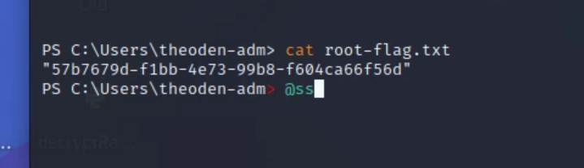

# Warmup

## Intro Activity

cat .ssh/config

HostKeyAlgorithms +ssh-rsa

PubkeyAcceptedAlgorithmns +ssh-rsa

<figure><figcaption>
Hydra Cracking Peregrins password
</figcaption></figure>

<figure><figcaption>
etc/passwd
</figcaption></figure>

<figure><figcaption>
etc/shadow
</figcaption></figure>

